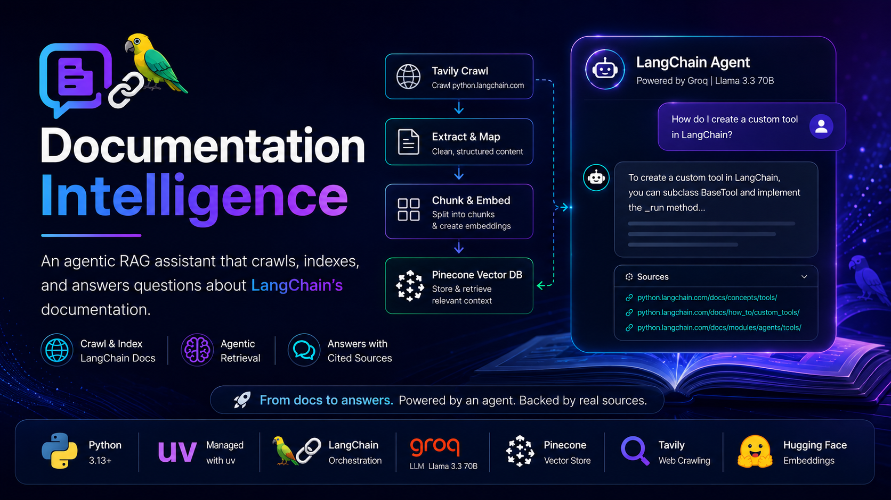

# 📖 Documentation Intelligence

**An agentic RAG assistant that crawls, indexes, and answers questions about LangChain's documentation.**

<p align="center">
  
  <br>
  <!--<em>↑ placeholder — swap in your own banner/screenshot once you add one (see "Assets" below)</em> -->
</p>

<div align="center">

[](https://www.python.org/downloads/) [](https://docs.astral.sh/uv/) [](https://www.langchain.com/) [](https://streamlit.io/) [](https://www.pinecone.io/) [](https://tavily.com/) [](https://groq.com/)

</div>

---

<!--## 🎬 Demo

<div align="center">
  
  <p><em>Interactive demo showing the LangChain Documentation Helper in action</em></p>
</div> -->

## 🎯 What this is

**Documentation Intelligence** is a small but complete Retrieval-Augmented Generation (RAG) system built around the official [LangChain Python documentation](https://python.langchain.com/). Instead of statically retrieving the top-k chunks for every question, it gives an **agent** a retrieval tool and lets it decide when (and how many times) to use it before answering — and it always reports back which doc pages it actually used.

It's split into two independent pipelines:

| Pipeline | File | What it does |
|---|---|---|
| 🌐 **Ingestion** | `ingestion.py` | Crawls `python.langchain.com` with Tavily, chunks the pages, embeds them, and writes them into Pinecone |
| 💬 **Query / Chat** | `main.py` + `backend/core.py` | A Streamlit chat app backed by a LangChain agent that retrieves context from Pinecone and answers with cited sources |

### ✨ Key Features
 
**RAG Pipeline Flow:**
 
1. 🌐 **Web Crawling**: Real-time web scraping and content extraction using Tavily's advanced crawling capabilities
2. 📚 **Document Processing**: Intelligent chunking and preprocessing of LangChain documentation
3. 🔍 **Vector Storage**: Advanced embedding and indexing using Pinecone for fast similarity search
4. 🎯 **Intelligent Retrieval**: Context-aware document retrieval based on user queries
5. 🧠 **Context-Aware Generation**: Provides accurate, contextual answers with source citations
6. 💬 **Interactive Interface**: User-friendly chat interface powered by Streamlit

## ⚙️ How it works

**Ingestion pipeline**
1. `TavilyCrawl` crawls `python.langchain.com` (depth-limited) and `TavilyExtract`/`TavilyMap` pull out clean page content
2. Each page becomes a LangChain `Document`, tagged with its source URL as metadata
3. `RecursiveCharacterTextSplitter` chunks the docs (4000 chars, 200 overlap)
4. Chunks are embedded locally with a HuggingFace sentence-transformer (`all-MiniLM-L6-v2` — no API key or cost) and upserted into Pinecone in concurrent async batches

**Query pipeline**
1. A LangChain agent (`create_agent`) is wired up with one tool: `retrive_context`, which runs a similarity search against the Pinecone index
2. The agent — running on Groq's `llama-3.3-70b-versatile` — decides when to call the tool and synthesizes an answer from what it retrieves
3. Source URLs are pulled out of the tool call's artifact and surfaced in the Streamlit UI under an expandable "Sources" panel

## 🛠️ Tech Stack

| Layer | Technology | Role |
|---|---|---|
| 🖥️ Frontend | Streamlit | Chat interface |
| 🧠 Orchestration | LangChain (`create_agent`) | Agentic RAG loop, tool calling |
| 🤖 LLM | Groq — Llama 3.3 70B | Answer generation |
| 🔡 Embeddings | HuggingFace `sentence-transformers/all-MiniLM-L6-v2` | Local, free text embeddings |
| 🔍 Vector store | Pinecone | Stores & retrieves embedded chunks |
| 🌐 Crawling | Tavily (`TavilyCrawl`, `TavilyExtract`, `TavilyMap`) | Sources the documentation content |
| 📦 Tooling | `uv` | Dependency management & lockfile |

## 🚀 Getting Started

### Prerequisites
- Python 3.13+
- [`uv`](https://docs.astral.sh/uv/) installed
- API keys for **Pinecone**, **Tavily**, and **Groq** (the embedding model runs locally, so no key is needed there)

### 1. Clone the repo
```bash
git clone https://github.com/abirmazumdar03/Documentation-Intelligence.git
cd Documentation-Intelligence
```

### 2. Set up your environment variables
Create a `.env` file in the project root:
```env
PINECONE_API_KEY=your_pinecone_api_key
INDEX_NAME=your_pinecone_index_name
TAVILY_API_KEY=your_tavily_api_key
GROQ_API_KEY=your_groq_api_key
```

### 3. Install dependencies
```bash
uv sync
```

### 4. Run the ingestion pipeline
This crawls the docs and populates your Pinecone index — only needs to be run once (or whenever you want to refresh the index):
```bash
uv run python ingestion.py
```

### 5. Launch the chat app
```bash
uv run streamlit run main.py
```
Then open `http://localhost:8501` in your browser.

## 📁 Project Structure

```
Documentation-Intelligence/
├── backend/
│   ├── __init__.py
│   └── core.py          # Agent, retrieval tool, run_llm()
├── ingestion.py          # Crawl → chunk → embed → index pipeline
├── logger.py             # Colored console logging helpers
├── main.py               # Streamlit chat UI
├── pyproject.toml        # Project metadata & dependencies (uv)
├── uv.lock
└── .gitignore
```

<!--## 🖼️ A note on assets

Right now the repo is source-only — there's no `static/` folder, logo, or banner image checked in, so this README doesn't reference any local images beyond the placeholder above. If you'd like the visual polish (banner, demo GIF, badges as image files instead of shields.io links), here's the calm version of what to add:

1. Create a `static/` folder at the project root
2. Drop in whatever you want to show off, e.g.:
   - `static/banner.png` — a screenshot or designed banner for the top of the README
   - `static/demo.gif` — a short screen recording of the chat app answering a question (tools like [ScreenToGif](https://www.screentogif.com/) or [Kap](https://getkap.co/) work well)
3. Reference them from the README with relative paths, e.g. ``
4. Commit the `static/` folder along with the README so the images actually render on GitHub

None of this is required to run the project — it just makes the README itself more engaging.

## 🧭 Ideas for next steps

A few things that aren't in the repo yet but would round it out nicely:
- A `LICENSE` file, if you want to make the reuse terms explicit
- A `tests/` folder with a couple of sanity checks for `backend/core.py`
- An `.env.example` so new contributors know exactly which variables to set -->

## 🤝 Contributing

Issues and pull requests are welcome — feel free to open one if you spot a bug or have an improvement in mind 😉.

---

<div align="center">

**Built by [abirmazumdar03](https://github.com/abirmazumdar03)**

</div>
